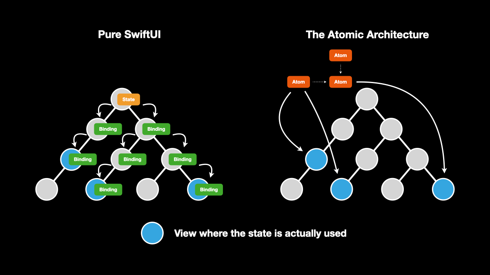
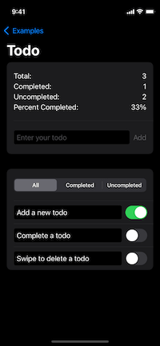
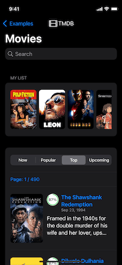
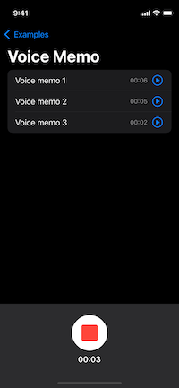
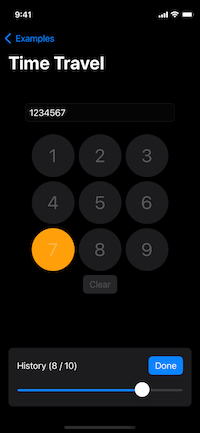
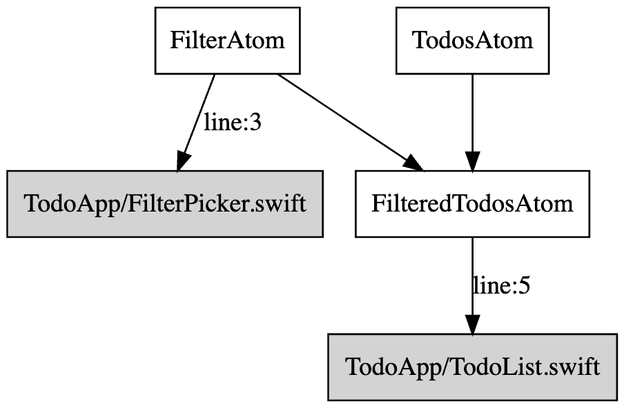
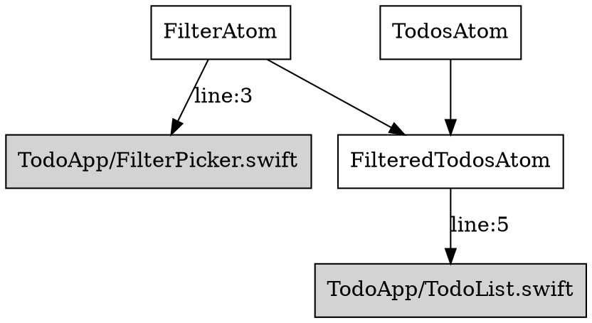

<h1 align="center">SwiftUI Atom Properties</h1>
<p align="center">A Reactive Data-Binding and Dependency Injection Library</br>for SwiftUI x Concurrency</p>
<p align="center"><a href="https://ra1028.github.io/swiftui-atom-properties/documentation/atoms">📔 API Reference</a></p>
<p align="center">
  <a href="https://github.com/ra1028/swiftui-atom-properties/actions"></a>
  <a href="https://github.com/ra1028/swiftui-atom-properties/releases/latest"></a>
  <a href="Package.swift"></a>
  <a href="Package.swift"></a>
  <a href="LICENSE"></a>
</p>

---

- [Introduction](#introduction)
- [Examples](#examples)
- [Getting Started](#getting-started)
  - [Installation](#installation)
  - [Requirements](#requirements)
  - [Documentation](#documentation)
  - [Basic Tutorial](#basic-tutorial)
- [Guides](#guides)
  - [AtomRoot](#atomroot)
  - [Atoms](#atoms)
  - [Modifiers](#modifiers)
  - [Property Wrappers](#property-wrappers)
  - [Context](#context)
  - [KeepAlive](#keepalive)
  - [Suspense](#suspense)
  - [Testing](#testing)
  - [Debugging](#debugging)
  - [Preview](#preview)
  - [Advanced Usage](#advanced-usage)
  - [Dealing with Known SwiftUI Bugs](#dealing-with-known-swiftui-bugs)
- [Contributing](#contributing)
- [Acknowledgements](#acknowledgements)
- [License](#license)

---

## Introduction

<p align="center">

|Reactive Data Binding|Effective Data Caching|Compile Safe<br>Dependency Injection|
|:------------------------|:----------------|:--------------------------------|
|Pieces of app data that can be accessed from anywhere propagate changes reactively.|Recompute atom data and views only when truly needed, otherwise, it caches data until no longer used.|Successful compilation guarantees that dependency injection is ready.|

</p>

SwiftUI Atom Properties offers practical capabilities to manage the complexity of modern apps. It effectively integrates the solution for both data-binding and dependency injection while allowing us to rapidly building an application.

### Motivation

SwiftUI offers a simple and understandable data-binding solution with built-in property wrappers but is a little uneasy for building middle to large-scale production apps. As a typical example, view data can only be shared by pushing it up to a common ancestor.  
EnvironmentObject was hoped to be a solution to the problem, but it ended up with let us create a huge state-holder object being provided from the root of an app, so pure SwiftUI needs state-drilling from the root to descendants in any way, which not only makes code-splitting difficult but also causes gradual performance degradation due to the huge view-tree computation as the app grow up.  

This library solves these problems by defining application data as distributed pieces called atoms, allowing data to be shared throughout the app as the source of truth. That said, an atom itself doesn't have an internal state, but rather retrieves the associated state from the context in which they are used, and ensures that the app is testable.  
It manages a directed graph of atoms and propagates data changes transitively from upstream to downstream, such that it updates only the views that truly need update while preventing expensive data recomputation, resulting in effortlessly high performance and efficient memory use.  



This approach guarantees the following principles:

- Reactively reflects data changes.
- Boilerplate-free interface where shared data has the same simple interface as SwiftUI built-ins.
- Compatible with any other libraries like [TCA](https://github.com/pointfreeco/swift-composable-architecture).
- Accelerates code-splitting by distributed & incremental state definition.
- Ensures testable with capabilities of dependency injection.
- Provides simplified interfaces for asynchronous process.
- Swift Concurrency based thread-safety.

### Quick Overview

To get a feel for this library, let's first look at the state management for a tiny counter app.  

The `CounterAtom` in the example below represents the shared data of a mutable count value.

```swift
struct CounterAtom: StateAtom, Hashable {
    func defaultValue(context: Context) -> Int {
        0
    }
}
```

Bind the atom to the view using `@WatchState` property wrapper so that it can obtain the value and write new values.

```swift
struct CountStepper: View {
    @WatchState(CounterAtom())
    var count

    var body: some View {
        Stepper(value: $count) {}
    }
}
```

`@Watch` property wrapper obtains the atom value read-only.  
Now that the app can share the state among multiple views without passing it down through initializer.

```swift
struct CounterView: View {
    @Watch(CounterAtom())
    var count

    var body: some View {
        VStack {
            Text("Count: \(count)")
            CountStepper()
        }
    }
}
```

If you like the principles, see the sample apps and the basic tutorial to learn more about this library.

---

## Examples

|  |  |  |  |  |  |
|-|-|-|-|-|-|

- [Counter](Examples/Packages/CrossPlatform/Sources/ExampleCounter)  
<sub>Demonstrates the minimum app using this library.</sub>
- [Todo](Examples/Packages/CrossPlatform/Sources/ExampleTodo)  
<sub>A simple todo app that has user interactions, showing how multiple atoms interact with each other.</sub>
- [The Movie DB](Examples/Packages/iOS/Sources/ExampleMovieDB)  
<sub>Demonstrates practical usage which close to a real-world app, using [TMDB](https://www.themoviedb.org/) API for asynchronous networking.</sub>
- [Map](Examples/Packages/iOS/Sources/ExampleMap)  
<sub>A simple but effective app that demonstrates how to wrap a framework in this library.</sub>
- [Voice Memo](Examples/Packages/iOS/Sources/ExampleVoiceMemo)  
<sub>Demonstrates how to manage complex state with multiple dependencies using [MVVM pattern](https://en.wikipedia.org/wiki/Model%E2%80%93view%E2%80%93viewmodel) on an atom. Created with imitate [TCA's example](https://github.com/pointfreeco/swift-composable-architecture/tree/main/Examples/VoiceMemos).</sub>
- [Time Travel](Examples/Packages/iOS/Sources/ExampleTimeTravel)  
<sub>A simple demo that demonstrates how to do [time travel debugging](https://en.wikipedia.org/wiki/Time_travel_debugging) with this library.</sub>

Each example has test target to show how to test your atoms with dependency injection as well.  
Open `Examples/App.xcodeproj` and play around with it!

---

## Getting Started

### Requirements

|       |Minimum Version|
|------:|--------------:|
|Swift  |5.6            |
|Xcode  |13.3           |
|iOS    |14.0           |
|macOS  |11.0           |
|tvOS   |14.0           |
|watchOS|7.0            |

### Installation

The module name of the package is `Atoms`. Choose one of the instructions below to install and add the following import statement to your source code.

```swift
import Atoms
```

#### [Xcode Package Dependency](https://developer.apple.com/documentation/xcode/adding_package_dependencies_to_your_app)

From Xcode menu: `File` > `Swift Packages` > `Add Package Dependency`

```text
https://github.com/ra1028/swiftui-atom-properties
```

#### [Swift Package Manager](https://www.swift.org/package-manager)

In your `Package.swift` file, first add the following to the package `dependencies`:

```swift
.package(url: "https://github.com/ra1028/swiftui-atom-properties"),
```

And then, include "Atoms" as a dependency for your target:

```swift
.target(name: "<target>", dependencies: [
    .product(name: "Atoms", package: "swiftui-atom-properties"),
]),
```

### Documentation

- [API Reference](https://ra1028.github.io/swiftui-atom-properties/documentation/atoms)
- [Example apps](Examples)

---

### Basic Tutorial

In this tutorial, we are going to create a simple todo app as an example. This app will support:

- Create todo items
- Edit todo items
- Filter todo items

Every view that uses atom must have an `AtomRoot` somewhere in the ancestor. In SwiftUI lifecycle apps, it's recommended to put it right under `WindowGroup`.

```swift
@main
struct TodoApp: App {
    var body: some Scene {
        WindowGroup {
            AtomRoot {
                TodoList()
            }
        }
    }
}
```

First, define a todo structure and an enum to filter todo list, and declare state with `StateAtom` that represents a mutable value.

```swift
struct Todo {
    var id: UUID
    var text: String
    var isCompleted: Bool
}

enum Filter: CaseIterable, Hashable {
    case all, completed, uncompleted
}

struct TodosAtom: StateAtom, Hashable {
    func defaultValue(context: Context) -> [Todo] {
        []
    }
}

struct FilterAtom: StateAtom, Hashable {
    func defaultValue(context: Context) -> Filter {
        .all
    }
}
```

The `FilteredTodosAtom` below represents the derived data that combines the above two atoms. You can think of derived data as the output of passing values to a pure function that derives a new value from the depending values.  

When dependent data changes, the derived data reactively updates, and the output value is cached until it truly needs to be updated, so don't need to worry about low performance due to the filter function being called each time the view recomputes.

```swift
struct FilteredTodosAtom: ValueAtom, Hashable {
    func value(context: Context) -> [Todo] {
        let filter = context.watch(FilterAtom())
        let todos = context.watch(TodosAtom())

        switch filter {
        case .all:         return todos
        case .completed:   return todos.filter(\.isCompleted)
        case .uncompleted: return todos.filter { !$0.isCompleted }
        }
    }
}
```

To create a new todo item, you need to access to a writable value that update the value of `TodosAtom` we defined previously. We can use `@WatchState` property wrapper to obtain a read-write access to it.

```swift
struct TodoCreator: View {
    @WatchState(TodosAtom())
    var todos

    @State
    var text = ""

    var body: some View {
        HStack {
            TextField("Enter your todo", text: $text)
            Button("Add") {
                todos.append(Todo(id: UUID(), text: text, isCompleted: false))
                text = ""
            }
        }
    }
}
```

Similarly, build a view to switch the value of `FilterAtom`. Get a `Binding` to the value exposed by `@WatchState` using `$` prefix.

```swift
struct TodoFilters: View {
    @WatchState(FilterAtom())
    var current

    var body: some View {
        Picker("Filter", selection: $current) {
            ForEach(Filter.allCases, id: \.self) { filter in
                switch filter {
                case .all:         Text("All")
                case .completed:   Text("Completed")
                case .uncompleted: Text("Uncompleted")
                }
            }
        }
        .pickerStyle(.segmented)
    }
}
```

Next, create a view to display and edit individual todo items.

```swift
struct TodoItem: View {
    @WatchState(TodosAtom())
    var allTodos

    @State
    var text: String

    @State
    var isCompleted: Bool

    let todo: Todo

    init(todo: Todo) {
        self.todo = todo
        self._text = State(initialValue: todo.text)
        self._isCompleted = State(initialValue: todo.isCompleted)
    }

    var index: Int {
        allTodos.firstIndex { $0.id == todo.id }!
    }

    var body: some View {
        Toggle(isOn: $isCompleted) {
            TextField("Todo", text: $text) {
                allTodos[index].text = text
            }
        }
        .onChange(of: isCompleted) { isCompleted in
            allTodos[index].isCompleted = isCompleted
        }
    }
}
```

Use `@Watch` to obtain the value of `FilteredTodosAtom` read-only. It updates to any of the dependent atoms are propagated to this view, and it re-render the todo list.  
Finally, assemble the views we've created so far and complete.

```swift
struct TodoList: View {
    @Watch(FilteredTodosAtom())
    var filteredTodos

    var body: some View {
        List {
            TodoCreator()
            TodoFilters()

            ForEach(filteredTodos, id: \.id) { todo in
                TodoItem(todo: todo)
            }
        }
    }
}
```

That is the basics for building apps using SwiftUI Atom Properties, but even asynchronous processes and more complex state management can be settled according to the same steps.  
See [Guides](#guides) section for more detail. Also, the [Examples](Examples) directory has several projects to explore concrete usage.

---

## Guides

This section introduces the available APIs and their uses.  
To look into the APIs in more detail, visit the [API referrence](https://ra1028.github.io/swiftui-atom-properties/documentation/atoms).

---

### [AtomRoot](https://ra1028.github.io/swiftui-atom-properties/documentation/atoms/atomroot)

Provides the internal store which provides atoms to view-tree through environment values.  
It must be the root of any views to manage atoms used throughout the application.

```swift
@main
struct ExampleApp: App {
    var body: some Scene {
        WindowGroup {
            AtomRoot {
                ExampleView()
            }
        }
    }
}
```

---

### Atoms

An atom represents a piece of state and is the source of truth for your app. It can also represent a derived data by combining and transforming one or more other atoms.  
Each atom does not actually have a global data inside, and retrieve values from the internal store provided by the `AtomRoot`. That's why *they can be accessed from anywhere, but never lose testability.*  

An atom and its value are associated using a unique `key` which is automatically defined if the atom conforms to `Hashable`, but you can also define it explicitly without Hashable.  

 ```swift
struct UserNameAtom: StateAtom {
    let userID: Int

    var key: Int {
        userID
    }

    func defaultValue(context: Context) -> String {
        "Robert"
    }
}
```

In order to provide the best interface and effective data-binding for the type of the resulting values, there are several variants of atoms as following.  

#### [ValueAtom](https://ra1028.github.io/swiftui-atom-properties/documentation/atoms/valueatom)

<details><summary><code>📖 Click to expand example code</code></summary>

```swift
struct LocaleAtom: ValueAtom, Hashable {
    func value(context: Context) -> Locale {
        .current
    }
}

struct LocaleView: View {
    @Watch(LocaleAtom())
    var locale

    var body: some View {
        Text(locale.identifier)
    }
}
```

</details>

|           |Description|
|:----------|:----------|
|Summary    |Provides a read-only value.|
|Output     |`T`|
|Use Case   |Computed property, Derived data, Dependency injection|

#### [StateAtom](https://ra1028.github.io/swiftui-atom-properties/documentation/atoms/stateatom)

<details><summary><code>📖 Click to expand example code</code></summary>

```swift
struct CounterAtom: StateAtom, Hashable {
    func defaultValue(context: Context) -> Int {
        0
    }
}

struct CounterView: View {
    @WatchState(CounterAtom())
    var count

    var body: some View {
        Stepper("Count: \(count)", value: $count)
    }
}
```

</details>

|           |Description|
|:----------|:----------|
|Summary    |Provides a read-write data.|
|Output     |`T`|
|Use Case   |Mutable data, Derived data|

#### [TaskAtom](https://ra1028.github.io/swiftui-atom-properties/documentation/atoms/taskatom)

<details><summary><code>📖 Click to expand example code</code></summary>

```swift
struct FetchUserAtom: TaskAtom, Hashable {
    func value(context: Context) async -> User? {
        await fetchUser()
    }
}

struct UserView: View {
    @Watch(FetchUserAtom())
    var userTask

    var body: some View {
        Suspense(userTask) { user in
            Text(user?.name ?? "Unknown")
        }
    }
}
```

</details>

|           |Description|
|:----------|:----------|
|Summary    |Initiates a non-throwing `Task` from the given `async` function.|
|Output     |`Task<T, Never>`|
|Use Case   |Non-throwing asynchronous operation e.g. Expensive calculation|

#### [ThrowingTaskAtom](https://ra1028.github.io/swiftui-atom-properties/documentation/atoms/throwingtaskatom)

<details><summary><code>📖 Click to expand example code</code></summary>

```swift
struct FetchMoviesAtom: ThrowingTaskAtom, Hashable {
    func value(context: Context) async throws -> [Movie] {
        try await fetchMovies()
    }
}

struct MoviesView: View {
    @Watch(FetchMoviesAtom())
    var moviesTask

    var body: some View {
        List {
            Suspense(moviesTask) { movies in
                ForEach(movies, id: \.id) { movie in
                    Text(movie.title)
                }
            } catch: { error in
                Text(error.localizedDescription)
            }
        }
    }
}
```

</details>

|           |Description|
|:----------|:----------|
|Summary    |Initiates a throwing `Task` from the given `async throws` function.|
|Output     |`Task<T, Error>`|
|Use Case   |Throwing asynchronous operation e.g. API call|

#### [AsyncSequenceAtom](https://ra1028.github.io/swiftui-atom-properties/documentation/atoms/asyncsequenceatom)

<details><summary><code>📖 Click to expand example code</code></summary>

```swift
struct NotificationAtom: AsyncSequenceAtom, Hashable {
    let name: Notification.Name

    func sequence(context: Context) -> NotificationCenter.Notifications {
        NotificationCenter.default.notifications(named: name)
    }
}

struct NotificationView: View {
    @Watch(NotificationAtom(name: UIApplication.didBecomeActiveNotification))
    var notificationPhase

    var body: some View {
        switch notificationPhase {
        case .suspending, .failure:
            Text("Unknown")

        case .success:
            Text("Active")
        }
    }
}
```

</details>

|           |Description|
|:----------|:----------|
|Summary    |Provides a `AsyncPhase` value that represents asynchronous, sequential elements of the given `AsyncSequence`.|
|Output     |`AsyncPhase<T, Error>`|
|Use Case   |Handle multiple asynchronous values e.g. web-sockets|

#### [PublisherAtom](https://ra1028.github.io/swiftui-atom-properties/documentation/atoms/publisheratom)

<details><summary><code>📖 Click to expand example code</code></summary>

```swift
struct TimerAtom: PublisherAtom, Hashable {
    func publisher(context: Context) -> AnyPublisher<Date, Never> {
        Timer.publish(every: 1, on: .main, in: .default)
            .autoconnect()
            .eraseToAnyPublisher()
    }
}

struct TimerView: View {
    @Watch(TimerAtom())
    var timerPhase

    var body: some View {
        if let date = timerPhase.value {
            Text(date.formatted(date: .numeric, time: .shortened))
        }
    }
}
```

</details>

|             |Description|
|:------------|:----------|
|Summary      |Provides a `AsyncPhase` value that represents sequence of values of the given `Publisher`.|
|Output       |`AsyncPhase<T, E: Error>`|
|Use Case     |Handle single or multiple asynchronous value(s) e.g. API call|

#### [ObservableObjectAtom](https://ra1028.github.io/swiftui-atom-properties/documentation/atoms/observableobjectatom)

<details><summary><code>📖 Click to expand example code</code></summary>

```swift
class Contact: ObservableObject {
    @Published var name = ""
    @Published var age = 20

    func haveBirthday() {
        age += 1
    }
}

struct ContactAtom: ObservableObjectAtom, Hashable {
    func object(context: Context) -> Contact {
        Contact()
    }
}

struct ContactView: View {
    @WatchStateObject(ContactAtom())
    var contact

    var body: some View {
        VStack {
            TextField("Enter your name", text: $contact.name)
            Text("Age: \(contact.age)")
            Button("Celebrate your birthday!") {
                contact.haveBirthday()
            }
        }
    }
}
```

</details>

|           |Description|
|:----------|:----------|
|Summary    |Instantiates an observable object.|
|Output     |`T: ObservableObject`|
|Use Case   |Mutable complex state object|

---

### Modifiers

Modifiers can be applied to an atom to produce a different versions of the original atom to make it more coding friendly or to reduce view re-computation for performance optimization.

#### [select(_:)](https://ra1028.github.io/swiftui-atom-properties/documentation/atoms/atom/select(_:))

<details><summary><code>📖 Click to expand example code</code></summary>

```swift
struct CountAtom: StateAtom, Hashable {
    func defaultValue(context: Context) -> Int {
        12345
    }
}

struct CountDisplayView: View {
    @Watch(CountAtom().select(\.description))
    var description  // : String

    var body: some View {
        Text(description)
    }
}
```

</details>

|               |Description|
|:--------------|:----------|
|Summary        |Selects a partial property with the specified key path from the original atom. The selected property doesn't notify updates if the new value is equivalent to the old value.|
|Output         |`T: Equatable`|
|Compatible     |All atoms types. The selected property must be `Equatable` compliant.|
|Use Case       |Performance optimization, Property scope restriction|

#### [phase](https://ra1028.github.io/swiftui-atom-properties/documentation/atoms/atom/phase)

<details><summary><code>📖 Click to expand example code</code></summary>

```swift
struct FetchWeatherAtom: ThrowingTaskAtom, Hashable {
    func value(context: Context) async throws -> Weather {
        try await fetchWeather()
    }
}

struct WeatherReportView: View {
    @Watch(FetchWeatherAtom().phase)
    var weatherPhase  // : AsyncPhase<Weather, Error>

    var body: some View {
        switch weatherPhase {
        case .suspending:
            Text("Loading.")

        case .success(let weather):
            Text("It's \(weather.description) now!")

        case .failure:
            Text("Failed to get weather data.")
        }
    }
}
```

</details>

|               |Description|
|:--------------|:----------|
|Summary        |Converts the `Task` that the original atom provides into `AsyncPhase`.|
|Output         |`AsyncPhase<T, E: Error>`|
|Compatible     |`TaskAtom`, `ThrowingTaskAtom`|
|Use Case       |Consume asynchronous result as `AsyncPhase`|

---

### Property Wrappers

The following property wrappers are used to bind atoms to view and recompute the view with data changes.  
By retrieving the atom through these property wrappers, the internal system marks the atom as in-use and the values are cached until that view is dismantled.

#### [@Watch](https://ra1028.github.io/swiftui-atom-properties/documentation/atoms/watch)

<details><summary><code>📖 Click to expand example code</code></summary>

```swift
struct UserNameAtom: StateAtom, Hashable {
    func defaultValue(context: Context) -> String {
        "John"
    }
}

struct UserNameDisplayView: View {
    @Watch(UserNameAtom())
    var name

    var body: some View {
        Text("User name: \(name)")
    }
}
```

</details>

|               |Description|
|:--------------|:----------|
|Summary        |This property wrapper is similar to `@State` or `@Environment`, but is always read-only. It recomputes the view with value changes.|
|Compatible     |All atom types|

#### [@WatchState](https://ra1028.github.io/swiftui-atom-properties/documentation/atoms/watchstate)

<details><summary><code>📖 Click to expand example code</code></summary>

```swift
struct UserNameAtom: StateAtom, Hashable {
    func defaultValue(context: Context) -> String {
        "Jim"
    }
}

struct UserNameInputView: View {
    @WatchState(UserNameAtom())
    var name

    var body: some View {
        VStack {
            TextField("User name", text: $name)
            Button("Clear") {
                name = ""
            }
        }
    }
}
```

</details>

|               |Description|
|:--------------|:----------|
|Summary        |This property wrapper is read-write as the same interface as `@State`. It recomputes the view with data changes. You can get a `Binding` to the value using `$` prefix.|
|Compatible     |`StateAtom`|

#### [@WatchStateObject](https://ra1028.github.io/swiftui-atom-properties/documentation/atoms/watchstateobject)

<details><summary><code>📖 Click to expand example code</code></summary>

```swift
class Counter: ObservableObject {
    @Published var count = 0

    func plus(_ value: Int) {
        count += value
    }
}

struct CounterAtom: ObservableObjectAtom, Hashable {
    func object(context: Context) -> Counter {
        Counter()
    }
}

struct CounterView: View {
    @WatchStateObject(CounterObjectAtom())
    var counter

    var body: some View {
        VStack {
            Text("Count: \(counter.count)")
            Stepper(value: $counter.count) {}
            Button("+100") {
                counter.plus(100)
            }
        }
    }
}
```

</details>

|               |Description|
|:--------------|:----------|
|Summary        |This property wrapper has the same interface as `@StateObject` and `@ObservedObject`. It recomputes the view when the observable object updates. You can get a `Binding` to one of the observable object's properties using `$` prefix.|
|Compatible     |`ObservableObjectAtom`|

#### [@ViewContext](https://ra1028.github.io/swiftui-atom-properties/documentation/atoms/viewcontext)

<details><summary><code>📖 Click to expand example code</code></summary>

```swift
struct FetchBookAtom: ThrowingTaskAtom, Hashable {
    let id: Int

    func value(context: Context) async throws -> Book {
        try await fetchBook(id: id)
    }
}

struct BookView: View {
    @ViewContext
    var context

    let id: Int

    var body: some View {
        let task = context.watch(FetchBookAtom(id: id))

        Suspense(task) { book in
            Text(book.content)
        } suspending: {
            ProgressView()
        }
    }
}
```

</details>

Unlike the property wrappers described the above, this property wrapper is not intended to bind single atom. It provides an `AtomViewContext` to the view, allowing for more functional control of atoms.  
For instance, the following controls can only be done through the context.  

- `refresh(_:)` operator that to reset an asynchronous atom value and wait for its completion.

```swift
await context.refresh(FetchMoviesAtom())
```

- `reset(_:)` operator that to clear the current atom value.

```swift
context.reset(CounterAtom())
```

The context also provides a flexible solution for passing dynamic parameters to atom's initializer. See [Context](#context) section for more detail.

---

### Context

Context is a structure for using and interacting with atom values from views or other atoms.  

|API|Use|
|:--|:--|
|[watch(_:)](https://ra1028.github.io/swiftui-atom-properties/documentation/atoms/atomwatchablecontext/watch(_:))|Obtains an atom value and starts watching its update.|
|[read(_:)](https://ra1028.github.io/swiftui-atom-properties/documentation/atoms/atomcontext/read(_:))|Obtains an atom value but does not watch its update.|
|[set(_:for:)](https://ra1028.github.io/swiftui-atom-properties/documentation/atoms/atomcontext/set(_:for:))|Sets a new value to the atom.|
|[[:_]](https://ra1028.github.io/swiftui-atom-properties/documentation/atoms/atomcontext/subscript(_:)) subscript|Read-write access for applying mutating methods.|
|[state(_:)](https://ra1028.github.io/swiftui-atom-properties/documentation/atoms/atomwatchablecontext/state(_:))|Gets a binding to the atom state.|
|[refresh(_:)](https://ra1028.github.io/swiftui-atom-properties/documentation/atoms/atomcontext/refresh(_:))|Reset an atom and await until asynchronous operation is complete.|
|[reset(_:)](https://ra1028.github.io/swiftui-atom-properties/documentation/atoms/atomcontext/reset(_:))|Reset an atom to the default value or a first output.|

There are the following types context as different contextual environments.  
The APIs described in each section below are their own specific functionality depending on the environment in which it is used, in addition to the above common APIs.  

#### [AtomViewContext](https://ra1028.github.io/swiftui-atom-properties/documentation/atoms/atomviewcontext)

<details><summary><code>📖 Click to expand example code</code></summary>

```swift
struct SearchQueryAtom: StateAtom, Hashable {
    func defaultValue(context: Context) -> String {
        ""
    }
}

struct FetchBooksAtom: ThrowingTaskAtom, Hashable {
    func value(context: Context) async throws -> [Book] {
        let query = context.watch(SearchQueryAtom())
        return try await fetchBooks(query: query)
    }
}

struct BooksView: View {
    @ViewContext
    var context: AtomViewContext

    var body: some View {
        // watch
        let booksTask = context.watch(FetchBooksAtom())     // Task<[Book], Error>
        // state
        let searchQuery = context.state(SearchQueryAtom())  // Binding<String>

        List {
            Suspense(booksTask) { books in
                ForEach(books, id: \.isbn) { book in
                    Text("\(book.title): \(book.isbn)")
                }
            }
        }
        .searchable(text: searchQuery)
        .refreshable {
            // refresh
            await context.refresh(FetchBooksAtom())
        }
        .toolbar {
            ToolbarItem(placement: .bottomBar) {
                HStack {
                    Button("Reset") {
                        // reset
                        context.reset(SearchQueryAtom())
                    }
                    Button("All") {
                        // set
                        context.set("All", for: SearchQueryAtom())
                    }
                    Button("Space") {
                        // subscript
                        context[SearchQueryAtom()].append(" ")
                    }
                    Button("Print") {
                        // read
                        let query = context.read(SearchQueryAtom())
                        print(query)
                    }
                    Button("Snapshot") {
                        // snapshot
                        let snapshot = context.snapshot()
                        print(snapshot)
                    }
                }
            }
        }
    }
}
```

</details>

A context available through the `@ViewContext` property wrapper when using atoms from a view.

|API|Use|
|:--|:--|
|[snapshot()](https://ra1028.github.io/swiftui-atom-properties/documentation/atoms/atomviewcontext/snapshot())|For debugging, takes a snapshot that captures specific set of values of atoms.|

#### [AtomTransactionContext](https://ra1028.github.io/swiftui-atom-properties/documentation/atoms/atomtransactioncontext)

<details><summary><code>📖 Click to expand example code</code></summary>

```swift
struct LocationManagerAtom: ValueAtom, Hashable {
    final class Coordinator: NSObject, CLLocationManagerDelegate { ... }

    func makeCoordinator() -> Coordinator {
        Coordinator()
    }

    func value(context: Context) -> LocationManagerProtocol {
        let manager = CLLocationManager()
        manager.delegate = context.coordinator
        return manager
    }
}

struct CoordinateAtom: ValueAtom, Hashable {
    func value(context: Context) -> CLLocationCoordinate2D? {
        let manager = context.watch(LocationManagerAtom())
        return manager.location?.coordinate
    }
}
```

</details>

A context passed as a parameter to the primary function of each atom type.  
This context type has a `coordinator` property that preserves an instance from the time an atom is used and initialized until it is unused and cleaned up, so it can be used to cache values or as a lifecycle for an atom.  

|API|Use|
|:--|:--|
|[coordinator](https://ra1028.github.io/swiftui-atom-properties/documentation/atoms/atomtransactioncontext/coordinator)|The atom’s associated coordinator that preservess a state until the atom will no longer be used.|

#### [AtomTestContext](https://ra1028.github.io/swiftui-atom-properties/documentation/atoms/atomtestcontext)

<details><summary><code>📖 Click to expand example code</code></summary>

```swift
protocol APIClientProtocol {
    func fetchMusics() async throws -> [Music]
}

struct APIClient: APIClientProtocol { ... }
struct MockAPIClient: APIClientProtocol { ... }

struct APIClientAtom: ValueAtom, Hashable {
    func value(context: Context) -> APIClientProtocol {
        APIClient()
    }
}

struct FetchMusicsAtom: ThrowingTaskAtom, Hashable {
    func value(context: Context) async throws -> [Music] {
        let api = context.watch(APIClientAtom())
        return try await api.fetchMusics()
    }
}

@MainActor
class FetchMusicsTests: XCTestCase {
    func testFetchMusicsAtom() async throws {
        let context = AtomTestContext()

        context.override(APIClientAtom()) { _ in
            MockAPIClient()
        }

        let musics = try await context.watch(FetchMusicsAtom()).value

        XCTAssertTrue(musics.isEmpty)
    }
}
```

</details>

A context that can simulate any scenarios in which atoms are used from a view or another atom and provides a comprehensive means of testing.

|API|Use|
|:--|:--|
|[unwatch(_:)](https://ra1028.github.io/swiftui-atom-properties/documentation/atoms/atomtestcontext/unwatch(_:))|Simulates a scenario in which the atom is no longer watched.|
|[override(_:with:)](https://ra1028.github.io/swiftui-atom-properties/documentation/atoms/atomtestcontext/override(_:with:)-1ce4h)|Overwrites the output of a specific atom or all atoms of the given type with the fixed value.|
|[waitUntilNextUpdate(timeout:)](https://ra1028.github.io/swiftui-atom-properties/documentation/atoms/atomtestcontext/waituntilnextupdate(timeout:))|Waits until any of atoms watched through this context is updated.|
|[onUpdate](https://ra1028.github.io/swiftui-atom-properties/documentation/atoms/atomtestcontext/onupdate)|Sets a closure that notifies there has been an update to one of the atoms.|

---

### [KeepAlive](https://ra1028.github.io/swiftui-atom-properties/documentation/atoms/keepalive)

`KeepAlive` allows the atom to preserve its data even if it's no longer watched to from anywhere.  
In the example case below, once master data is obtained from the server, it can be cached in memory until the app process terminates.

```swift
struct FetchMasterDataAtom: ThrowingTaskAtom, KeepAlive, Hashable {
    func value(context: Context) async throws -> MasterData {
        try await fetchMasterData()
    }
}
```

---

### [Suspense](https://ra1028.github.io/swiftui-atom-properties/documentation/atoms/suspense)

`Suspense` awaits the resulting value of the given `Task` and displays the content depending on its phase.  
Optionally, you can pass `suspending` content to be displayed until the task completes, and pass `catch` content to be displayed if the task fails.  

```swift
struct NewsView: View {
    @Watch(LatestNewsAtom())
    var newsTask: Task<News, Error>

    var body: some View {
        Suspense(newsTask) { news in
            Text(news.content)
        } suspending: {
            ProgressView()
        } catch: { error in
            Text(error.localizedDescription)
        }
    }
}
```

---

### Testing

This library naturally integrates dependency injection and data-binding to provide a comprehensive means of testing. It allows you to test per small atom such that you can keep writing simple test cases per smallest unit of state without compose all states into a huge object and supposing complex integration test scenarios.  
In order to fully test your app, this library guarantees the following principles:

- Hermetic environment that no data is shared between test cases.
- Dependencies are replaceable with any of mock/stub/fake/spy per test case.
- Test cases can reproduce any possible scenarios at the view-layer.

In the test case, you first create an `AtomTestContext` instance that behaves similarly to other context types. The context allows for flexible reproduction of expected scenarios for testing using the control functions described in the [Context](#context) section.  
In addition, it's able to replace the atom value with test-friendly dependencies with `override` function. It helps you to write a reproducible & stable testing.  
Since atom needs to be used from the main actor to guarantee thread-safety, `XCTestCase` class that to test atoms should have `@MainActor` attribute.

<details><summary>Click to expand the classes to be tested</summary>

```swift

struct Book: Equatable {
    var title: String
    var isbn: String
}

protocol APIClientProtocol {
    func fetchBook(isbn: String) async throws -> Book
}

struct APIClient: APIClientProtocol {
    func fetchBook(isbn: String) async throws -> Book {
        ... // Networking logic.
    }
}

class MockAPIClient: APIClientProtocol {
    var response: Book?

    func fetchBook(isbn: String) async throws -> Book {
        guard let response = response else {
            throw URLError(.unknown)
        }
        return response
    }
}

struct APIClientAtom: ValueAtom, Hashable {
    func value(context: Context) -> APIClientProtocol {
        APIClient()
    }
}

struct FetchBookAtom: ThrowingTaskAtom, Hashable {
    let isbn: String

    func value(context: Context) async throws -> Book {
        let api = context.watch(APIClientAtom())
        return try await api.fetchBook(isbn: isbn)
    }
}

```

</details>

```swift

@MainActor
class FetchBookTests: XCTestCase {
    func testFetch() async throws {
        let context = AtomTestContext()
        let api = MockAPIClient()

        // Override the atom value with the mock instance.
        context.override(APIClientAtom()) { _ in
            api
        }

        let expected = Book(title: "A book", isbn: "ISBN000–0–0000–0000–0")

        // Inject the expected response to the mock.
        api.response = expected

        let book = try await context.watch(FetchBookAtom(isbn: "ISBN000–0–0000–0000–0")).value

        XCTAssertEqual(book, expected)
    }
}
```

---

### Debugging

This library defines a Directed Acyclic Graph (DAG) internally to centrally manage atom states, making it easy to analyze its dependencies and where they are (or are not) being used.  
There are the following two ways to get a [Snapshot](https://ra1028.github.io/swiftui-atom-properties/documentation/atoms/snapshot) of the dependency graph at a given point in time.  

The first is to get `Snapshot` through [@ViewContext](#atomviewcontext). This API is suitable for obtaining and analyzing debugging information on demand.  

```swift
@ViewContext
var context

var debugButton: some View {
    Button("Dump dependency graph") {
        let snapshot = context.snapshot()
        print(snapshot.graphDescription())
    }
}
```

Or, you can observe all updates of atoms and always continue to receive `Snapshots` at that point in time through `observe(_:)` modifier of [AtomRoot](https://ra1028.github.io/swiftui-atom-properties/documentation/atoms/atomroot) or [AtomRelay](https://ra1028.github.io/swiftui-atom-properties/documentation/atoms/atomrelay).  
Note that observing in `AtomRoot` will receive all atom updates that happened in the whole app, but observing in `AtomRelay` will only receive atoms used in the descendant views.  

```swift
AtomRoot {
    HomeScreen()
}
.observe { snapshot in
    print(snapshot.graphDescription())
}
```

Calling the [restore()](https://ra1028.github.io/swiftui-atom-properties/documentation/atoms/snapshot/restore()) method of the obtained `Snapshot` will roll back to the states and dependency graph at that point in time to see what happened.  
The debugging technique is called [time travel debugging](https://en.wikipedia.org/wiki/Time_travel_debugging), and the example application [here](Examples/Packages/iOS/Sources/ExampleTimeTravel) demonstrates how it works.  

In addition, [graphDescription()](https://ra1028.github.io/swiftui-atom-properties/documentation/atoms/snapshot/graphdescription()) method returns a string, that represents the dependencies graph and where they are used, as a String in [graph description language DOT](https://graphviz.org/doc/info/lang.html).  
This can be converted to an image using [Graphviz](https://graphviz.org), a graph visualization tool, to visually analyze information about the state of the application, as shown below.  





---

### Preview

Even in SwiftUI previews, the view must have an `AtomRoot` somewhere in the ancestor. However, since This library offers the new solution for dependency injection, you don't need to do painful DI each time you create previews anymore. You can to override the atoms that you really want to inject substitutions.

```swift
struct NewsList_Preview: PreviewProvider {
    static var previews: some View {
        AtomRoot {
            NewsList()
        }
        .override(APIClientAtom()) { _ in
            StubAPIClient()
        }
    }
}
```

---

### Advanced Usage

#### Use atoms without watching

<details><summary><code>📖 Click to expand example code</code></summary>

```swift
struct TextAtom: StateAtom, Hashable {
    func value(context: Context) -> String {
        ""
    }
}

struct TextCopyView: View {
    @ViewContext
    var context

    var body: some View {
        Button("Copy") {
            UIPasteboard.general.string = context.read(TextAtom())
        }
    }
}
```

</details>

The `read(_:)` function is a way to get the data of an atom without having watch to and receiving future updates of it. It's commonly used inside functions triggered by call-to-actions.

#### Dynamically initiate atom families

<details><summary><code>📖 Click to expand example code</code></summary>

```swift
struct FetchUserAtom: ThrowingTaskAtom {
    let id: Int

    // This atom can also conforms to `Hashable` in this case,
    // but this example specifies the key explicitly.
    var key: Int {
        id
    }

    func value(context: Context) async throws -> Value {
        try await fetchUser(id: id)
    }
}

struct UserView: View {
    let id: Int

    @ViewContext
    var context

    var body: some View {
        let task = context.watch(FetchUserAtom(id: id))

        Suspense(task) { user in
            VStack {
                Text("Name: \(user.name)")
                Text("Age: \(user.age)")
            }
        }
    }
}
```

</details>

Each atom must have a unique `key` to be uniquely associated with its value. As described in the [Atoms](#atoms) section, it is automatically synthesized by conforming to `Hashable`, but with explicitly specifying a `key` allowing you to pass arbitrary external parameters to the atom. It is commonly used, for example, to retrieve user information associated with a dynamically specified ID from a server.

#### Use atoms from objects

<details><summary><code>📖 Click to expand example code</code></summary>

```swift
struct MessageLoaderAtom: ObservableObjectAtom, Hashable {
    func object(context: Context) -> MessageLoader {
        MessageLoader(context: context)
    }
}

@MainActor
class MessageLoader: ObservableObject {
    let context: AtomContext

    @Published
    var phase = AsyncPhase<[Message], Error>.suspending

    init(context: AtomContext) {
        self.context = context
    }

    func load() async {
        let api = context.read(APIClientAtom())
        phase = await AsyncPhase {
            try await api.fetchMessages(offset: 0)
        }
    }

    func loadNext() async {
        guard let messages = phase.value else {
            return
        }

        let api = context.read(APIClientAtom())
        let nextPhase = await AsyncPhase {
            try await api.fetchMessages(offset: messages.count)
        }
        phase = nextPhase.map { messages + $0 }
    }
}
```

</details>

You can pass a context to your object and interact with other atoms at any asynchronous timing. However, in that case, when the `watch` is called, it end up with the object instance itself will be re-created with fresh data. Therefore, you can explicitly prevent the use of the `watch` by passing it as `AtomContext` type.

#### Manage side-effects

<details><summary><code>📖 Click to expand example code</code></summary>

```swift
struct PersistentCounterAtom: StateAtom, Hashable {
    func defaultValue(context: Context) -> Int {
        UserDefaults.standard.integer(forKey: "persistence_key")
    }

    func updated(newValue: Int, oldValue: Int, reader: Reader) {
        if newValue != oldValue {
            UserDefaults.standard.set(newValue, forKey: "persistence_key")
        }
    }
}
```

</details>

All atom types can optionally implement [`updated(newValue:oldValue:reader:`](https://ra1028.github.io/swiftui-atom-properties/documentation/atoms/atom/updated(newvalue:oldvalue:reader:)-fgb8) method to manage arbitrary side-effects of value updates, such as state persistence, state synchronization, logging, and etc.  
In the above example, the initial state of the atom is retrieved from UserDefaults, and when the user updates the state, the value is reflected into UserDefaults as a side effect.

---

### Dealing with Known SwiftUI Bugs

#### Modal presentation causes assertionFailure when dismissing it (Fixed in iOS15)

<details><summary><code>💡 Click to expand workaround</code></summary>

```swift
struct RootView: View {
    @State
    var isPresented = false

    @ViewContext
    var context

    var body: some View {
        VStack {
            Text("Example View")
        }
        .sheet(isPresented: $isPresented) {
            AtomRelay(context) {
                MailView()
            }
        }
    }
}
```

</details>

Unfortunately, SwiftUI has a bug in iOS14 or lower where the `EnvironmentValue` is removed from a screen presented with `.sheet` just before dismissing it. Since this library is designed based on `EnvironmentValue`, this bug end up triggering the friendly `assertionFailure` that is added so that developers can easily aware of forgotten `AtomRoot` implementation.  
As a workaround, `AtomRelay` has the ability to explicitly inherit the internal store through `AtomViewContext` from the parent view.

#### Some SwiftUI modifiers cause memory leak (Fixed in iOS16)

<details><summary><code>💡 Click to expand workaround</code></summary>

```swift
@ViewContext
var context

...

.refreshable { [context] in
    await context.refresh(FetchDataAtom())
}
```

```swift
@State
var isShowingSearchScreen = false

...

.onSubmit { [$isShowingSearchScreen] in
    $isShowingSearchScreen.wrappedValue = true
}
```

</details>

In iOS 15 or lower, some modifiers in SwiftUI seem to cause an internal memory leak if it captures `self` implicitly or explicitly. To avoid that bug, make sure that `self` is not captured when using those modifiers.  
Below are the list of modifiers I found that cause memory leaks:

- [`refreshable(action:)`](https://developer.apple.com/documentation/SwiftUI/View/refreshable(action:))
- [`onSubmit(of:_:)`](https://developer.apple.com/documentation/swiftui/view/onsubmit(of:_:))

---

## Contributing

Any type of contribution is welcome! e.g.

- Give it star ⭐ & fork this repository.
- Report bugs with reproducible steps.
- Propose new features.
- Add more documentations.
- Provide repos of sample apps using this library.
- Become a maintainer after making multiple contributions.
- Become a [sponsor](https://github.com/sponsors/ra1028).

---

## Acknowledgements

- [Recoil](https://recoiljs.org)
- [Riverpod](https://riverpod.dev)
- [Jotai](https://github.com/pmndrs/jotai)

---

## License

[MIT © Ryo Aoyama](LICENSE)

---
