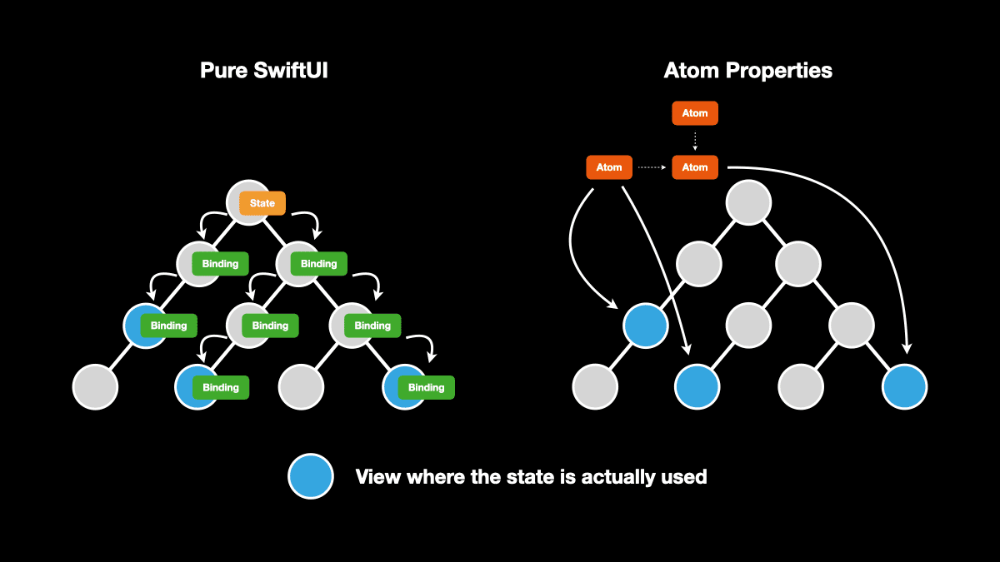

<h1 align="center">Atoms</h1>
<p align="center">Atomic approach state management and dependency injection for SwiftUI</p>
<p align="center"><a href="https://ra1028.github.io/swiftui-atom-properties/documentation/atoms">📔 API Reference</a></p>
<p align="center">
  <a href="https://github.com/ra1028/swiftui-atom-properties/actions"></a>
  <a href="https://github.com/ra1028/swiftui-atom-properties/releases/latest"></a>
  <a href="Package.swift"></a>
  <a href="Package.swift"></a>
  <a href="LICENSE"></a>
</p>

---

- [Introduction](#introduction)
- [Examples](#examples)
- [Getting Started](#getting-started)
  - [Documentation](#documentation)
  - [Requirements](#requirements)
  - [Installation](#installation)
- [Basic Tutorial](#basic-tutorial)
- [Guides](#guides)
  - [AtomRoot](#atomroot)
  - [Atom](#atom)
  - [Modifier](#modifier)
  - [Attribute](#attribute)
  - [Property Wrapper](#property-wrapper)
  - [Context](#context)
  - [View](#view)
  - [Techniques](#techniques)
  - [Advanced Usage](#advanced-usage)
  - [Dealing with Known SwiftUI Bugs](#dealing-with-known-swiftui-bugs)
- [Contributing](#contributing)
- [Acknowledgements](#acknowledgements)
- [License](#license)

---

## Introduction

<p align="center">

|Reactive Data Binding|Effective Caching|Compile Safe</br>Dependency Injection|
|:------------------------|:----------------|:--------------------------------|
|Pieces of app data that can be accessed from anywhere propagate changes reactively.|Cache data during in use and recompute only when truly needed.|Successful compilation guarantees that dependency injection is ready.|

</p>

Atoms offer a simple but practical capability to tackle the complexity of modern apps. It effectively integrates the solution for both state management and dependency injection while allowing us to rapidly build a robust and testable application.  
Building state by compositing atoms automatically optimizes rendering based on its dependency graph. This solves the problem of performance degradation caused by extra re-render which occurs before you realize.  



### Quick Overview

- Declare your primitive atoms.

```swift
struct CounterAtom: StateAtom, Hashable {
    func defaultValue(context: Context) -> Int {
        0
    }
}
```

- Bind the atom to your views.

```swift
struct CountStepper: View {
    @WatchState(CounterAtom())
    var count

    var body: some View {
        Stepper(value: $count) {}
    }
}
```

- Share state across views without passing a Binding.

```swift
struct CounterView: View {
    @Watch(CounterAtom())
    var count

    var body: some View {
        VStack {
            Text("Count: \(count)")
            CountStepper()
        }
    }
}
```

---

## Examples

|  |  |  |  |  |  |
|-|-|-|-|-|-|

- [Counter](Examples/Packages/CrossPlatform/Sources/ExampleCounter)  
<sub>Demonstrates the minimum app using this library.</sub>
- [Todo](Examples/Packages/CrossPlatform/Sources/ExampleTodo)  
<sub>A simple todo app that has user interactions, showing how multiple atoms interact with each other.</sub>
- [The Movie DB](Examples/Packages/iOS/Sources/ExampleMovieDB)  
<sub>Demonstrates practical usage which close to a real-world app, using [TMDB](https://www.themoviedb.org/) API for asynchronous networking.</sub>
- [Map](Examples/Packages/iOS/Sources/ExampleMap)  
<sub>A simple but effective app that demonstrates how to wrap a framework in this library.</sub>
- [Voice Memo](Examples/Packages/iOS/Sources/ExampleVoiceMemo)  
<sub>Demonstrates how to decompose and manage complex states and dependencies into compact atoms. Created to mimic the [TCA's example](https://github.com/pointfreeco/swift-composable-architecture/tree/main/Examples/VoiceMemos).</sub>
- [Time Travel](Examples/Packages/iOS/Sources/ExampleTimeTravel)  
<sub>A simple demo that demonstrates how to do [time travel debugging](https://en.wikipedia.org/wiki/Time_travel_debugging) with this library.</sub>

Each example has a test target too to demonstrate how to test your atoms with dependency injection.  
Open `Examples/Project.xcodeproj` and play around with it!

---

## Getting Started

### Documentation

- [API Reference](https://ra1028.github.io/swiftui-atom-properties/documentation/atoms)
- [Example apps](Examples)

### Requirements

|       |Minimum Version|
|------:|--------------:|
|Swift  |5.10, 6.0      |
|Xcode  |15.4, 16.1     |
|iOS    |14.0           |
|macOS  |11.0           |
|tvOS   |14.0           |
|watchOS|7.0            |

### Installation

The module name of the package is `Atoms`. Choose one of the instructions below to install and add the following import statement to your source code.

```swift
import Atoms
```

#### [Xcode Package Dependency](https://developer.apple.com/documentation/xcode/adding_package_dependencies_to_your_app)

From Xcode menu: `File` > `Swift Packages...`

```text
https://github.com/ra1028/swiftui-atom-properties
```

#### [Swift Package Manager](https://www.swift.org/package-manager)

In your `Package.swift` file, first add the following to the package `dependencies`:

```swift
.package(url: "https://github.com/ra1028/swiftui-atom-properties"),
```

And then, include "Atoms" as a dependency for your target:

```swift
.target(name: "<target>", dependencies: [
    .product(name: "Atoms", package: "swiftui-atom-properties"),
]),
```

---

## Basic Tutorial

In this tutorial, we are going to create a simple todo app as an example. This app will support to create/edit/filter todo items.  

Every view that uses atom must have an `AtomRoot` somewhere in the ancestor. In SwiftUI lifecycle apps, it's recommended to put it right under `WindowGroup`.

```swift
@main
struct TodoApp: App {
    var body: some Scene {
        WindowGroup {
            AtomRoot {
                TodoList()
            }
        }
    }
}
```

First, define a todo entity and an enum that represents filtering methods, and declare an atom with `StateAtom` that represents a mutable state.

```swift
struct Todo {
    var id: UUID
    var text: String
    var isCompleted: Bool
}

enum Filter: CaseIterable, Hashable {
    case all, completed, uncompleted
}

struct TodosAtom: StateAtom, Hashable {
    func defaultValue(context: Context) -> [Todo] {
        []
    }
}

struct FilterAtom: StateAtom, Hashable {
    func defaultValue(context: Context) -> Filter {
        .all
    }
}
```

The `FilteredTodosAtom` below represents the derived data that combines the above two atoms. You can think of derived data as the output of passing values to a pure function that derives a new value from the depending values.  

When dependent data changes, the derived data reactively updates, and the output value is cached until it truly needs to be updated, so you don't need to worry about low performance due to the filter function being called each time the view recomputes.

```swift
struct FilteredTodosAtom: ValueAtom, Hashable {
    func value(context: Context) -> [Todo] {
        let filter = context.watch(FilterAtom())
        let todos = context.watch(TodosAtom())

        switch filter {
        case .all:         return todos
        case .completed:   return todos.filter(\.isCompleted)
        case .uncompleted: return todos.filter { !$0.isCompleted }
        }
    }
}
```

To create a new todo item, you need to access to a writable value that update the value of `TodosAtom` you defined previously.  

```swift
struct TodoCreator: View {
    @WatchState(TodosAtom())
    var todos

    @State
    var text = ""

    var body: some View {
        HStack {
            TextField("Enter your todo", text: $text)
            Button("Add") {
                todos.append(Todo(id: UUID(), text: text, isCompleted: false))
                text = ""
            }
        }
    }
}
```

Similarly, build a view to switch the value of `FilterAtom`. Get a `Binding` to the value exposed by `@WatchState` using `$` prefix.

```swift
struct TodoFilters: View {
    @WatchState(FilterAtom())
    var current

    var body: some View {
        Picker("Filter", selection: $current) {
            ForEach(Filter.allCases, id: \.self) { filter in
                switch filter {
                case .all:         Text("All")
                case .completed:   Text("Completed")
                case .uncompleted: Text("Uncompleted")
                }
            }
        }
        .pickerStyle(.segmented)
    }
}
```

Next, create a view to display a todo item. It also supports editing the item.

```swift
struct TodoItem: View {
    @WatchState(TodosAtom())
    var allTodos

    @State
    var text: String

    @State
    var isCompleted: Bool

    let todo: Todo

    init(todo: Todo) {
        self.todo = todo
        self._text = State(initialValue: todo.text)
        self._isCompleted = State(initialValue: todo.isCompleted)
    }

    var index: Int {
        allTodos.firstIndex { $0.id == todo.id }!
    }

    var body: some View {
        Toggle(isOn: $isCompleted) {
            TextField("Todo", text: $text) {
                allTodos[index].text = text
            }
        }
        .onChange(of: isCompleted) { isCompleted in
            allTodos[index].isCompleted = isCompleted
        }
    }
}
```

Finally, assemble the views you've created so far and complete.

```swift
struct TodoList: View {
    @Watch(FilteredTodosAtom())
    var filteredTodos

    var body: some View {
        List {
            TodoCreator()
            TodoFilters()

            ForEach(filteredTodos, id: \.id) { todo in
                TodoItem(todo: todo)
            }
        }
    }
}
```

That is the basics for building apps using Atoms, but even asynchronous processes and more complex state management can be settled according to the same steps.  
See [Guides](#guides) section for more detail. Also, the [Examples](Examples) directory has several projects to explore concrete usage.

---

## Guides

This section introduces the available APIs and their uses.  
To look into the APIs in more detail, visit the [API referrence](https://ra1028.github.io/swiftui-atom-properties/documentation/atoms).

---

### [AtomRoot](https://ra1028.github.io/swiftui-atom-properties/documentation/atoms/atomroot)

This view allows descendant views to use atoms. It must be the root of any views throughout the application.

```swift
@main
struct ExampleApp: App {
    var body: some Scene {
        WindowGroup {
            AtomRoot {
                ExampleView()
            }
        }
    }
}
```

---

### Atom

An atom represents a piece of state and is the source of truth for your app. It can also represent a derived data by combining and transforming one or more other atoms.  
Each atom does not actually have a global data inside, and retrieve values from the store provided by the `AtomRoot`. That's why *they can be accessed from anywhere, but never lose testability.*  

An atom and its value are associated using a unique `key` which is automatically defined if the atom conforms to `Hashable`, but you can also define it explicitly without Hashable.  

 ```swift
struct UserNameAtom: StateAtom {
    let userID: Int

    var key: Int {
        userID
    }

    func defaultValue(context: Context) -> String {
        "Robert"
    }
}
```

In order to provide the best interface and effective data-binding for the type of the resulting values, there are several variants of atoms as following.  

#### [ValueAtom](https://ra1028.github.io/swiftui-atom-properties/documentation/atoms/valueatom)

|           |Description|
|:----------|:----------|
|Summary    |Provides a read-only value.|
|Output     |`T`|
|Use Case   |Computed property, Derived data, Dependency injection|

<details><summary><code>📖 Example</code></summary>

```swift
struct LocaleAtom: ValueAtom, Hashable {
    func value(context: Context) -> Locale {
        .current
    }
}

struct LocaleView: View {
    @Watch(LocaleAtom())
    var locale

    var body: some View {
        Text(locale.identifier)
    }
}
```

</details>

#### [StateAtom](https://ra1028.github.io/swiftui-atom-properties/documentation/atoms/stateatom)

|           |Description|
|:----------|:----------|
|Summary    |Provides a read-write data.|
|Output     |`T`|
|Use Case   |Mutable data, Derived data|

<details><summary><code>📖 Example</code></summary>

```swift
struct CounterAtom: StateAtom, Hashable {
    func defaultValue(context: Context) -> Int {
        0
    }
}

struct CounterView: View {
    @WatchState(CounterAtom())
    var count

    var body: some View {
        Stepper("Count: \(count)", value: $count)
    }
}
```

</details>

#### [TaskAtom](https://ra1028.github.io/swiftui-atom-properties/documentation/atoms/taskatom)

|           |Description|
|:----------|:----------|
|Summary    |Initiates a non-throwing `Task` from the given `async` function.|
|Output     |`Task<T, Never>`|
|Use Case   |Non-throwing asynchronous operation e.g. Expensive calculation|

<details><summary><code>📖 Example</code></summary>

```swift
struct FetchUserAtom: TaskAtom, Hashable {
    func value(context: Context) async -> User? {
        await fetchUser()
    }
}

struct UserView: View {
    @Watch(FetchUserAtom())
    var userTask

    var body: some View {
        Suspense(userTask) { user in
            Text(user?.name ?? "Unknown")
        }
    }
}
```

</details>

#### [ThrowingTaskAtom](https://ra1028.github.io/swiftui-atom-properties/documentation/atoms/throwingtaskatom)

|           |Description|
|:----------|:----------|
|Summary    |Initiates a throwing `Task` from the given `async throws` function.|
|Output     |`Task<T, any Error>`|
|Use Case   |Throwing asynchronous operation e.g. API call|

<details><summary><code>📖 Example</code></summary>

```swift
struct FetchMoviesAtom: ThrowingTaskAtom, Hashable {
    func value(context: Context) async throws -> [Movie] {
        try await fetchMovies()
    }
}

struct MoviesView: View {
    @Watch(FetchMoviesAtom())
    var moviesTask

    var body: some View {
        List {
            Suspense(moviesTask) { movies in
                ForEach(movies, id: \.id) { movie in
                    Text(movie.title)
                }
            } catch: { error in
                Text(error.localizedDescription)
            }
        }
    }
}
```

</details>

#### [AsyncPhaseAtom](https://ra1028.github.io/swiftui-atom-properties/documentation/atoms/asyncphaseatom)

|           |Description|
|:----------|:----------|
|Summary    |Provides an `AsyncPhase` value that represents a result of the given asynchronous throwable function.|
|Output     |`AsyncPhase<T, E: Error>` (`AsyncPhase<T, any Error>` in Swift 5)|
|Use Case   |Throwing or non-throwing asynchronous operation e.g. API call|

Note:  
The [typed throws](https://github.com/swiftlang/swift-evolution/blob/main/proposals/0413-typed-throws.md) feature introduced in Swift 6 allows the `Failure` type of the produced `AsyncPhase` to be specified as any type or even non-throwing, but in Swift 5 without it, the `Failure` type is always be `any Error`.  
Here is a chart of the syntax in `typed throws` and the type of resulting `AsyncPhase`.  

|Syntax             |Shorthand          |Produced                  |
|:------------------|:------------------|:-------------------------|
|`throws(E)`        |`throws(E)`        |`AsyncPhase<T, E>`        |
|`throws(any Error)`|`throws`           |`AsyncPhase<T, any Error>`|
|`throws(Never)`    |                   |`AsyncPhase<T, Never>`    |

<details><summary><code>📖 Example</code></summary>

```swift
struct FetchTrendingSongsAtom: AsyncPhaseAtom, Hashable {
    func value(context: Context) async throws(FetchSongsError) -> [Song] {
        try await fetchTrendingSongs()
    }
}

struct TrendingSongsView: View {
    @Watch(FetchTrendingSongsAtom())
    var phase

    var body: some View {
        List {
            switch phase {
            case .success(let songs):
                ForEach(songs, id: \.id) { song in
                    Text(song.title)
                }

            case .failure(.noData):
                Text("There are no currently trending songs.")

            case .failure(let error):
                Text(error.localizedDescription)
            }
        }
    }
}
```

</details>

#### [AsyncSequenceAtom](https://ra1028.github.io/swiftui-atom-properties/documentation/atoms/asyncsequenceatom)

|           |Description|
|:----------|:----------|
|Summary    |Provides an `AsyncPhase` value that represents asynchronous, sequential elements of the given `AsyncSequence`.|
|Output     |`AsyncPhase<T, any Error>`|
|Use Case   |Handle multiple asynchronous values e.g. web-sockets|

<details><summary><code>📖 Example</code></summary>

```swift
struct NotificationAtom: AsyncSequenceAtom, Hashable {
    let name: Notification.Name

    func sequence(context: Context) -> NotificationCenter.Notifications {
        NotificationCenter.default.notifications(named: name)
    }
}

struct NotificationView: View {
    @Watch(NotificationAtom(name: UIApplication.didBecomeActiveNotification))
    var notificationPhase

    var body: some View {
        switch notificationPhase {
        case .suspending, .failure:
            Text("Unknown")

        case .success:
            Text("Active")
        }
    }
}
```

</details>

#### [PublisherAtom](https://ra1028.github.io/swiftui-atom-properties/documentation/atoms/publisheratom)

|             |Description|
|:------------|:----------|
|Summary      |Provides an `AsyncPhase` value that represents sequence of values of the given `Publisher`.|
|Output       |`AsyncPhase<T, E: Error>`|
|Use Case     |Handle single or multiple asynchronous value(s) e.g. API call|

<details><summary><code>📖 Example</code></summary>

```swift
struct TimerAtom: PublisherAtom, Hashable {
    func publisher(context: Context) -> AnyPublisher<Date, Never> {
        Timer.publish(every: 1, on: .main, in: .default)
            .autoconnect()
            .eraseToAnyPublisher()
    }
}

struct TimerView: View {
    @Watch(TimerAtom())
    var timerPhase

    var body: some View {
        if let date = timerPhase.value {
            Text(date.formatted(date: .numeric, time: .shortened))
        }
    }
}
```

</details>

#### [ObservableObjectAtom](https://ra1028.github.io/swiftui-atom-properties/documentation/atoms/observableobjectatom)

|           |Description|
|:----------|:----------|
|Summary    |Instantiates an observable object.|
|Output     |`T: ObservableObject`|
|Use Case   |Mutable complex state object|

<details><summary><code>📖 Example</code></summary>

```swift
class Contact: ObservableObject {
    @Published var name = ""
    @Published var age = 20

    func haveBirthday() {
        age += 1
    }
}

struct ContactAtom: ObservableObjectAtom, Hashable {
    func object(context: Context) -> Contact {
        Contact()
    }
}

struct ContactView: View {
    @WatchStateObject(ContactAtom())
    var contact

    var body: some View {
        VStack {
            TextField("Enter your name", text: $contact.name)
            Text("Age: \(contact.age)")
            Button("Celebrate your birthday!") {
                contact.haveBirthday()
            }
        }
    }
}
```

</details>

---

### Modifier

Modifiers can be applied to an atom to produce a different versions of the original atom to make it more coding friendly or to reduce view re-computation for performance optimization.

#### [changes(of:)](https://ra1028.github.io/swiftui-atom-properties/documentation/atoms/atom/changes(of:))

|               |Description|
|:--------------|:----------|
|Summary        |Derives a partial property with the specified key path from the original atom and prevent it from updating its downstream when its new value is equivalent to old value.|
|Output         |`T: Equatable`|
|Compatible     |All atoms types. The derived property must be `Equatable` compliant.|
|Use Case       |Performance optimization, Property scope restriction|

<details><summary><code>📖 Example</code></summary>

```swift
struct CountAtom: StateAtom, Hashable {
    func defaultValue(context: Context) -> Int {
        12345
    }
}

struct CountDisplayView: View {
    @Watch(CountAtom().changes(of: \.description))
    var description  // : String

    var body: some View {
        Text(description)
    }
}
```

</details>

#### [changes](https://ra1028.github.io/swiftui-atom-properties/documentation/atoms/atom/changes)

|               |Description|
|:--------------|:----------|
|Summary        |Prevents the atom from updating its child views or atoms when its new value is the same as its old value.|
|Output         |`T: Equatable`|
|Compatible     |All atom types that produce `Equatable` compliant value.|
|Use Case       |Performance optimization|

<details><summary><code>📖 Example</code></summary>

```swift
struct CountAtom: StateAtom, Hashable {
    func defaultValue(context: Context) -> Int {
        12345
    }
}

struct CountDisplayView: View {
    @Watch(CountAtom().changes)
    var count  // : Int

    var body: some View {
        Text(count.description)
    }
}
```

</details>

#### [animation(_:)](https://ra1028.github.io/swiftui-atom-properties/documentation/atoms/atom/animation(_:))

|               |Description|
|:--------------|:----------|
|Summary        |Animates the view watching the atom when the value updates.|
|Output         |`T`|
|Compatible     |All atom types.|
|Use Case       |Apply animation to a view|

<details><summary><code>📖 Example</code></summary>

```swift
struct TextAtom: ValueAtom, Hashable {
    func value(context: Context) -> String {
        ""
    }
}

struct ExampleView: View {
    @Watch(TextAtom().animation())
    var text

    var body: some View {
        Text(text)
    }
}
```

</details>

#### [TaskAtom/phase](https://ra1028.github.io/swiftui-atom-properties/documentation/atoms/taskatom/phase) | [ThrowingTaskAtom/phase](https://ra1028.github.io/swiftui-atom-properties/documentation/atoms/throwingtaskatom/phase)

|               |Description|
|:--------------|:----------|
|Summary        |Converts the `Task` that the original atom provides into `AsyncPhase`.|
|Output         |`AsyncPhase<T, E: Error>`|
|Compatible     |`TaskAtom`, `ThrowingTaskAtom`|
|Use Case       |Consume asynchronous result as `AsyncPhase`|

<details><summary><code>📖 Example</code></summary>

```swift
struct FetchWeatherAtom: ThrowingTaskAtom, Hashable {
    func value(context: Context) async throws -> Weather {
        try await fetchWeather()
    }
}

struct WeatherReportView: View {
    @Watch(FetchWeatherAtom().phase)
    var weatherPhase  // : AsyncPhase<Weather, any Error>

    var body: some View {
        switch weatherPhase {
        case .suspending:
            Text("Loading.")

        case .success(let weather):
            Text("It's \(weather.description) now!")

        case .failure:
            Text("Failed to get weather data.")
        }
    }
}
```

</details>

---

### Attribute

The attributes allow control over how the atoms essentially work, for example, cache control of the state.

#### [Scoped](https://ra1028.github.io/swiftui-atom-properties/documentation/atoms/scoped)

`Scoped` preserves the atom state in the scope nearest to the ancestor of where it is used and prevents it from being shared out of scope.

<details><summary><code>📖 Example</code></summary>

In the example case below, each `SearchPane` uses the `SearchQueryAtom` state isolated for each scope.

```swift
struct SearchQueryAtom: StateAtom, Scoped, Hashable {
    func defaultValue(context: Context) -> String {
         ""
    }
}

VStack {
    AtomScope {
        SearchPane()
    }

    AtomScope {
        SearchPane()
    }
}
```

</details>

#### [KeepAlive](https://ra1028.github.io/swiftui-atom-properties/documentation/atoms/keepalive)

`KeepAlive` allows the atom to preserve its data even if it's no longer watched from anywhere.  

<details><summary><code>📖 Example</code></summary>

In the example case below, once master data is obtained from the server, it can be cached in memory until the app process terminates.

```swift
struct FetchMasterDataAtom: ThrowingTaskAtom, KeepAlive, Hashable {
    func value(context: Context) async throws -> MasterData {
        try await fetchMasterData()
    }
}
```

</details>

#### [Refreshable](https://ra1028.github.io/swiftui-atom-properties/documentation/atoms/refreshable)

`Refreshable` allows you to implement a custom refreshable behavior to an atom.

<details><summary><code>📖 Example</code></summary>

It adds custom refresh behavior to `ValueAtom` which is inherently unable to refresh.  
It's useful when need to have arbitrary refresh behavior or implementing refresh when value depends on private atom.  
In this example, `FetchMoviesPhaseAtom` transparently exposes the value of `FetchMoviesTaskAtom` as `AsyncPhase` so that the error can be handled easily inside the atom, and `Refreshable` gives refreshing behavior to `FetchMoviesPhaseAtom` itself.  

```swift
private struct FetchMoviesTaskAtom: ThrowingTaskAtom, Hashable {
    func value(context: Context) async throws -> [Movies] {
        try await fetchMovies()
    }
}

struct FetchMoviesPhaseAtom: ValueAtom, Refreshable, Hashable {
    func value(context: Context) -> AsyncPhase<[Movies], any Error> {
        context.watch(FetchMoviesTaskAtom().phase)
    }

    func refresh(context: CurrentContext) async -> AsyncPhase<[Movies], any Error> {
        await context.refresh(FetchMoviesTaskAtom().phase)
    }

    func effect(context: CurrentContext) -> some AtomEffect {
        UpdateEffect {
            if case .failure = context.read(self) {
                print("Failed to fetch movies.")
            }
        }
    }
}
```

</details>

#### [Resettable](https://ra1028.github.io/swiftui-atom-properties/documentation/atoms/resettable)

`Resettable` allows you to implement a custom reset behavior to an atom.

<details><summary><code>📖 Example</code></summary>

It adds custom reset behavior to an atom that will be executed upon atom reset.  
It's useful when need to have arbitrary reset behavior or implementing reset when value depends on private atom.  
In following example, `RandomIntAtom` generates a random value using generated from private `RandomNumberGeneratorAtom`, and `Resettable` gives ability to replace exposed reset with  `RandomNumberGeneratorAtom` reset.  

```swift
struct RandomIntAtom: ValueAtom, Resettable, Hashable {
    func value(context: Context) -> Int {
        var generator = context.watch(RandomNumberGeneratorAtom())
        return .random(in: 0..<100, using: &generator)
    }

    func reset(context: CurrentContext) {
        context.reset(RandomNumberGeneratorAtom())
    }
}

private struct RandomNumberGeneratorAtom: ValueAtom, Hashable {
    func value(context: Context) -> CustomRandomNumberGenerator {
        CustomRandomNumberGenerator()
    }
}
```

</details>

---

### Property Wrapper

The following property wrappers are used to bind atoms to view and recompute the view with data changes.  
By retrieving the atom through these property wrappers, the internal system marks the atom as in-use and the values are cached until that view is dismantled.

#### [@Watch](https://ra1028.github.io/swiftui-atom-properties/documentation/atoms/watch)

|               |Description|
|:--------------|:----------|
|Summary        |This property wrapper is similar to `@State` or `@Environment`, but is always read-only. It recomputes the view with value changes.|
|Compatible     |All atom types|

<details><summary><code>📖 Example</code></summary>

```swift
struct UserNameAtom: StateAtom, Hashable {
    func defaultValue(context: Context) -> String {
        "John"
    }
}

struct UserNameDisplayView: View {
    @Watch(UserNameAtom())
    var name

    var body: some View {
        Text("User name: \(name)")
    }
}
```

</details>

#### [@WatchState](https://ra1028.github.io/swiftui-atom-properties/documentation/atoms/watchstate)

|               |Description|
|:--------------|:----------|
|Summary        |This property wrapper is read-write as the same interface as `@State`. It recomputes the view with data changes. You can get a `Binding` to the value using `$` prefix.|
|Compatible     |`StateAtom`|

<details><summary><code>📖 Example</code></summary>

```swift
struct UserNameAtom: StateAtom, Hashable {
    func defaultValue(context: Context) -> String {
        "Jim"
    }
}

struct UserNameInputView: View {
    @WatchState(UserNameAtom())
    var name

    var body: some View {
        VStack {
            TextField("User name", text: $name)
            Button("Clear") {
                name = ""
            }
        }
    }
}
```

</details>

#### [@WatchStateObject](https://ra1028.github.io/swiftui-atom-properties/documentation/atoms/watchstateobject)

|               |Description|
|:--------------|:----------|
|Summary        |This property wrapper has the same interface as `@StateObject` and `@ObservedObject`. It recomputes the view when the observable object updates. You can get a `Binding` to one of the observable object's properties using `$` prefix.|
|Compatible     |`ObservableObjectAtom`|

<details><summary><code>📖 Example</code></summary>

```swift
class Counter: ObservableObject {
    @Published var count = 0

    func plus(_ value: Int) {
        count += value
    }
}

struct CounterAtom: ObservableObjectAtom, Hashable {
    func object(context: Context) -> Counter {
        Counter()
    }
}

struct CounterView: View {
    @WatchStateObject(CounterObjectAtom())
    var counter

    var body: some View {
        VStack {
            Text("Count: \(counter.count)")
            Stepper(value: $counter.count) {}
            Button("+100") {
                counter.plus(100)
            }
        }
    }
}
```

</details>

#### [@ViewContext](https://ra1028.github.io/swiftui-atom-properties/documentation/atoms/viewcontext)

Unlike the property wrappers described the above, this property wrapper is not intended to bind single atom. It provides an `AtomViewContext` to the view, allowing for more functional control of atoms.  
For instance, the following controls can only be done through the context.  

- `refresh(_:)` operator to reset an asynchronous atom value and wait for its completion.

```swift
await context.refresh(FetchMoviesAtom())
```

- `reset(_:)` operator to clear the current atom value.

```swift
context.reset(CounterAtom())
```

The context also provides a flexible solution for passing dynamic parameters to atom's initializer. See [Context](#context) section for more detail.

<details><summary><code>📖 Example</code></summary>

```swift
struct FetchBookAtom: ThrowingTaskAtom, Hashable {
    let id: Int

    func value(context: Context) async throws -> Book {
        try await fetchBook(id: id)
    }
}

struct BookView: View {
    @ViewContext
    var context

    let id: Int

    var body: some View {
        let task = context.watch(FetchBookAtom(id: id))

        Suspense(task) { book in
            Text(book.content)
        } suspending: {
            ProgressView()
        }
    }
}
```

</details>

---

### Context

Context is a structure for using and interacting with atom values from views or other atoms.  

|API|Use|
|:--|:--|
|[watch(_:)](https://ra1028.github.io/swiftui-atom-properties/documentation/atoms/atomtestcontext/watch(_:))|Gets an atom value and starts watching its update.|
|[read(_:)](https://ra1028.github.io/swiftui-atom-properties/documentation/atoms/atomcontext/read(_:))|Gets an atom value but does not watch its update.|
|[set(_:for:)](https://ra1028.github.io/swiftui-atom-properties/documentation/atoms/atomcontext/set(_:for:))|Sets a new value to the atom.|
|[modify(_:body:)](https://ra1028.github.io/swiftui-atom-properties/documentation/atoms/atomcontext/modify(_:body:))|Modifies the cached atom value.|
|[subscript[]](https://ra1028.github.io/swiftui-atom-properties/documentation/atoms/atomcontext/subscript(_:))|Read-write access for applying mutating methods.|
|[refresh(_:)](https://ra1028.github.io/swiftui-atom-properties/documentation/atoms/atomcontext/refresh(_:)-7xzm9)|Produce a new value of the atom after waiting until asynchronous operation is complete.|
|[reset(_:)](https://ra1028.github.io/swiftui-atom-properties/documentation/atoms/atomcontext/reset(_:)-8u78a)|Reset an atom to the default value or a first output.|

Contexts are provided in the following types depending on the environment where they are provided. In addition to the common APIs described above, each context type may have its unique functionalities.  

#### [AtomViewContext](https://ra1028.github.io/swiftui-atom-properties/documentation/atoms/atomviewcontext)

A context available through the `@ViewContext` property wrapper when using atoms from a view.

|API|Use|
|:--|:--|
|[binding(_:)](https://ra1028.github.io/swiftui-atom-properties/documentation/atoms/atomviewcontext/binding(_:))|Gets a binding to the atom state.|
|[snapshot()](https://ra1028.github.io/swiftui-atom-properties/documentation/atoms/atomviewcontext/snapshot())|For debugging, takes a snapshot that captures specific set of values of atoms.|

<details><summary><code>📖 Example</code></summary>

```swift
struct SearchQueryAtom: StateAtom, Hashable {
    func defaultValue(context: Context) -> String {
        ""
    }
}

struct FetchBooksAtom: ThrowingTaskAtom, Hashable {
    func value(context: Context) async throws -> [Book] {
        let query = context.watch(SearchQueryAtom())
        return try await fetchBooks(query: query)
    }
}

struct BooksView: View {
    @ViewContext
    var context: AtomViewContext

    var body: some View {
        // watch
        let booksTask = context.watch(FetchBooksAtom())     // Task<[Book], any Error>
        // binding
        let searchQuery = context.binding(SearchQueryAtom())  // Binding<String>

        List {
            Suspense(booksTask) { books in
                ForEach(books, id: \.isbn) { book in
                    Text("\(book.title): \(book.isbn)")
                }
            }
        }
        .searchable(text: searchQuery)
        .refreshable {
            // refresh
            await context.refresh(FetchBooksAtom())
        }
        .toolbar {
            ToolbarItem(placement: .bottomBar) {
                HStack {
                    Button("Reset") {
                        // reset
                        context.reset(SearchQueryAtom())
                    }
                    Button("All") {
                        // set
                        context.set("All", for: SearchQueryAtom())
                    }
                    Button("Space") {
                        // subscript
                        context[SearchQueryAtom()].append(" ")
                    }
                    Button("Print") {
                        // read
                        let query = context.read(SearchQueryAtom())
                        print(query)
                    }
                    Button("Snapshot") {
                        // snapshot
                        let snapshot = context.snapshot()
                        print(snapshot)
                    }
                }
            }
        }
    }
}
```

</details>

#### [AtomTransactionContext](https://ra1028.github.io/swiftui-atom-properties/documentation/atoms/atomtransactioncontext)

A context passed as a parameter to the primary function of each atom type.  

<details><summary><code>📖 Example</code></summary>

```swift
final class LocationManagerDelegate: NSObject, CLLocationManagerDelegate { ... }

struct LocationManagerDelegateAtom: ValueAtom, Hashable {
    func value(context: Context) -> LocationManagerDelegate {
        LocationManagerDelegate()
    }
}

struct LocationManagerAtom: ValueAtom, Hashable {
    func value(context: Context) -> any LocationManagerProtocol {
        let delegate = context.watch(LocationManagerDelegateAtom())
        let manager = CLLocationManager()
        manager.delegate = delegate
        return manager
    }
}
```

</details>

#### [AtomTestContext](https://ra1028.github.io/swiftui-atom-properties/documentation/atoms/atomtestcontext)

A context that can simulate any scenarios in which atoms are used from a view or another atom and provides a comprehensive means of testing.

|API|Use|
|:--|:--|
|[lookup(_:)](https://ra1028.github.io/swiftui-atom-properties/documentation/atoms/atomtestcontext/lookup(_:))|Gets an atom value without creating a cache.|
|[unwatch(_:)](https://ra1028.github.io/swiftui-atom-properties/documentation/atoms/atomtestcontext/unwatch(_:))|Simulates a scenario in which the atom is no longer watched.|
|[override(_:with:)](https://ra1028.github.io/swiftui-atom-properties/documentation/atoms/atomtestcontext/override(_:with:)-82t4q)|Overwrites the output of a specific atom or all atoms of the given type with the fixed value.|
|[waitForUpdate(timeout:)](https://ra1028.github.io/swiftui-atom-properties/documentation/atoms/atomtestcontext/waitforupdate(timeout:))|Waits until any of the atoms watched through this context have been updated.|
|[wait(for:timeout:until:)](https://ra1028.github.io/swiftui-atom-properties/documentation/atoms/atomtestcontext/wait(for:timeout:until:))|Waits for the given atom until it will be a certain state.|
|[onUpdate](https://ra1028.github.io/swiftui-atom-properties/documentation/atoms/atomtestcontext/onupdate)|Sets a closure that notifies there has been an update to one of the atoms.|

<details><summary><code>📖 Example</code></summary>

```swift
protocol APIClientProtocol {
    func fetchMusics() async throws -> [Music]
}

struct APIClient: APIClientProtocol { ... }
struct MockAPIClient: APIClientProtocol { ... }

struct APIClientAtom: ValueAtom, Hashable {
    func value(context: Context) -> any APIClientProtocol {
        APIClient()
    }
}

struct FetchMusicsAtom: ThrowingTaskAtom, Hashable {
    func value(context: Context) async throws -> [Music] {
        let api = context.watch(APIClientAtom())
        return try await api.fetchMusics()
    }
}

@MainActor
class FetchMusicsTests: XCTestCase {
    func testFetchMusicsAtom() async throws {
        let context = AtomTestContext()

        context.override(APIClientAtom()) { _ in
            MockAPIClient()
        }

        let musics = try await context.watch(FetchMusicsAtom()).value

        XCTAssertTrue(musics.isEmpty)
    }
}
```

</details>

---

### View

#### [AtomScope](https://ra1028.github.io/swiftui-atom-properties/documentation/atoms/atomscope)

`AtomScope` allows you to monitor changes or override atoms used in descendant views. Unlike `AtomRoot`, they affect only those in scope.  
See the [Atom Override](#atom-override) and [Debugging](#debugging) sections for specific uses.  

```swift
AtomScope {
    CounterView()
}
.scopedObserve { snapshot in
    if let count = snapshot.lookup(CounterAtom()) {
        print(count)
    }
}
```

#### [Suspense](https://ra1028.github.io/swiftui-atom-properties/documentation/atoms/suspense)

`Suspense` awaits the resulting value of the given `Task` and displays the content depending on its phase.  
Optionally, you can pass `suspending` content to be displayed until the task completes, and pass `catch` content to be displayed if the task fails.  

```swift
struct NewsView: View {
    @Watch(LatestNewsAtom())
    var newsTask: Task<News, any Error>

    var body: some View {
        Suspense(newsTask) { news in
            Text(news.content)
        } suspending: {
            ProgressView()
        } catch: { error in
            Text(error.localizedDescription)
        }
    }
}
```

---

### Techniques

#### Scoped Atom

This library is designed with the shared state as a single source of truth first principle, but also the state can be scoped depending on the intended use.  
Scoped atoms preserves the atom state in the [AtomScope](#atomscope) nearest to the ancestor of where it is used and prevents it from being shared out of scope. `Scoped` is the attribute for that feature.  

```swift
struct TextInputAtom: StateAtom, Scoped, Hashable {
    func defaultValue(context: Context) -> String {
        ""
    }
}

struct TextInputView: View {
    @Watch(TextInputAtom())
    ...
}

VStack {
    // The following two TextInputView don't share TextInputAtom state.

    AtomScope {
        TextInputView()
    }

    AtomScope {
        TextInputView()
    }
}
```

When multiple `AtomScope`s are nested, and you want to store and share an atom state in the particular scope, it is able to define a scope ID which is to find a matching scope.  

```swift
struct TextScopeID: Hashable {}

struct TextInputAtom: StateAtom, Scoped, Hashable {
    var scopeID: TextScopeID {
        TextScopeID()
    }

    func defaultValue(context: Context) -> String {
        ""
    }
}

AtomScope(id: TextScopeID()) {
    TextInputView()

    AtomScope {
        // Shares TextInputAtom state with the TextInputView placed in the parent scope.
        TextInputView()
    }
}
```

This is also useful when multiple identical screens are stacked and each screen needs isolated states such as user inputs.  
Note that other atoms that depend on scoped atoms will be in a shared state and must be given `Scoped` attribute as well in order to scope them as well.  

#### Atom Effect

Atom effects are an API for managing side effects that are synchronized with the atom's lifecycle. They are widely applicable for variety of usage such as state synchronization, state persistence, logging, and etc, by observing and reacting to state changes.  

You can create custom effects that conform to the [`AtomEffect`](https://ra1028.github.io/swiftui-atom-properties/documentation/atoms/atomeffect) protocol, but there are several predefined effects.  

|API|Use|
|:--|:--|
|[InitializeEffect](https://ra1028.github.io/swiftui-atom-properties/documentation/atoms/initializeeffect)|Performs an arbitrary action when the atom is initialized.|
|[UpdateEffect](https://ra1028.github.io/swiftui-atom-properties/documentation/atoms/updateeffect)|Performs an arbitrary action when the atom is updated.|
|[ReleaseEffect](https://ra1028.github.io/swiftui-atom-properties/documentation/atoms/releaseeffect)|Performs an arbitrary action when the atom is released.|
|[MergedEffect](https://ra1028.github.io/swiftui-atom-properties/documentation/atoms/mergedeffect)|Merges multiple atom effects into one.|

Atom effects are attached to atoms via the [`Atom.effect(context:)`](https://ra1028.github.io/swiftui-atom-properties/documentation/atoms/atom/effect(context:)-4wm5m) function.  

```swift
struct CounterAtom: StateAtom, Hashable {
    func defaultValue(context: Context) -> Int {
        UserDefaults.standard.integer(forKey: "persistence_key")
    }

    func effect(context: CurrentContext) -> some AtomEffect {
        UpdateEffect {
            UserDefaults.standard.set(context.read(self), forKey: "persistence_key")
        }
    }
}
```

Each atom initializes its effect when the atom is initialized, and the effect is retained until the atom is no longer used from anywhere and is released, thus it allows to declare stateful side effects.  

```swift
struct CounterAtom: StateAtom, Hashable {
    func defaultValue(context: Context) -> Int {
        0
    }

    func effect(context: CurrentContext) -> some AtomEffect {
        CountTimerEffect()
    }
}


final class CountTimerEffect: AtomEffect {
    private var timer: Timer?

    func initialized(context: Context) {
        timer = Timer.scheduledTimer(withTimeInterval: 1, repeats: true) { _ in
            context[CounterAtom()] += 1
        }
    }

    func updated(context: Context) {
        print("Count: \(context.read(CounterAtom()))")
    }

    func released(context: Context) {
        timer?.invalidate()
        timer = nil
    }
}
```

#### Atom Override

You can override atoms in [AtomRoot](#atomroot) or [AtomScope](#atomscope) to overwirete the atom states for dependency injection or faking state in particular view, which is useful especially for testing.  

Overriding in `AtomRoot` return the given value instead of the actual atom value no matter where the overridden atom is used in its descendant views.  

```swift
// Overrides the CounterAtom value to be `456` in anywhere in the ancestor.
AtomRoot {
    RootView()
}
.override(CounterAtom()) { _ in
    456
}
```

On the other hand, overriding with `AtomScope` behaves similar to overriding in `AtomRoot`, but the atoms used in other scopes nested in the descendants are not overridden.  

```swift
// Overrides the CounterAtom value to be `456` only for this scope.
AtomScope {
    CountDisplay()

    // CounterAtom is not overridden in this scope.
    AtomScope {
        CountDisplay()
    }
}
.scopedOverride(CounterAtom()) { _ in
    456
}
```

If you want to inherit the overridden atom from the parent scope, you can explicitly pass `@ViewContext` context that has gotten in the parent scope. Then, the new scope completely inherits the parent scope's context.  

```swift
@ViewContext
var context

var body: some {
    // Inherites the parent scope's overrides.
    AtomScope(inheriting: context) {
        CountDisplay()
    }
}
```

Note that overridden atoms in `AtomScope` automatically be scoped, but other atoms that depend on them will be in a shared state and must be given `Scoped` attribute (See also: [Scoped Atom](#scoped-atom)) in order to avoid it from being shared across out of scope.  

See [Testing](#testing) section for details on dependency injection on unit tests.  

#### Testing

This library naturally integrates dependency injection and data-binding to provide a comprehensive means of testing. It allows you to test per small atom such that you can keep writing simple test cases per smallest unit of state without compose all states into a huge object and supposing complex integration test scenarios.  
In order to fully test your app, this library guarantees the following principles:

- Hermetic environment that no data is shared between test cases.
- Dependencies are replaceable with any of mock/stub/fake/spy per test case.
- Test cases can reproduce any possible scenarios at the view-layer.

In the test case, you first create an `AtomTestContext` instance that behaves similarly to other context types. The context allows for flexible reproduction of expected scenarios for testing using the control functions described in the [Context](#context) section.  
In addition, it's able to replace the atom value with test-friendly dependencies with `override` function. It helps you to write a reproducible & stable testing.  
Since atom needs to be used from the main actor to guarantee thread-safety, functions that tests atoms should have `@MainActor` attribute.

<details><summary>Click to expand the classes to be tested</summary>

```swift

struct Book: Equatable {
    var title: String
    var isbn: String
}

protocol APIClientProtocol {
    func fetchBook(isbn: String) async throws -> Book
}

struct APIClient: APIClientProtocol {
    func fetchBook(isbn: String) async throws -> Book {
        ... // Networking logic.
    }
}

class MockAPIClient: APIClientProtocol {
    var response: Book?

    func fetchBook(isbn: String) async throws -> Book {
        guard let response else {
            throw URLError(.unknown)
        }
        return response
    }
}

struct APIClientAtom: ValueAtom, Hashable {
    func value(context: Context) -> any APIClientProtocol {
        APIClient()
    }
}

struct FetchBookAtom: ThrowingTaskAtom, Hashable {
    let isbn: String

    func value(context: Context) async throws -> Book {
        let api = context.watch(APIClientAtom())
        return try await api.fetchBook(isbn: isbn)
    }
}

```

</details>

```swift

class FetchBookTests: XCTestCase {
    @MainActor
    func testFetch() async throws {
        let context = AtomTestContext()
        let api = MockAPIClient()

        // Override the atom value with the mock instance.
        context.override(APIClientAtom()) { _ in
            api
        }

        let expected = Book(title: "A book", isbn: "ISBN000–0–0000–0000–0")

        // Inject the expected response to the mock.
        api.response = expected

        let book = try await context.watch(FetchBookAtom(isbn: "ISBN000–0–0000–0000–0")).value

        XCTAssertEqual(book, expected)
    }
}
```

#### Debugging

This library defines a Directed Acyclic Graph (DAG) internally to centrally manage atom states, making it easy to analyze its dependencies and where they are (or are not) being used.  
There are the following two ways to get a [Snapshot](https://ra1028.github.io/swiftui-atom-properties/documentation/atoms/snapshot) of the dependency graph at a given point in time.  

The first is to get `Snapshot` through [@ViewContext](#atomviewcontext). This API is suitable for obtaining and analyzing debugging information on demand.  

```swift
@ViewContext
var context

var debugButton: some View {
    Button("Dump dependency graph") {
        let snapshot = context.snapshot()
        print(snapshot.graphDescription())
    }
}
```

Or, you can observe all state changes and always continue to receive `Snapshots` at that point in time with `observe(_:)` modifier of [AtomRoot](#atomroot) or with `scopedObserve(_:)` modifier of [AtomScope](#atomscope).  
Note that observing in `AtomRoot` will receive every state changes that happened in the whole app, but observing in `AtomScope` will observe changes of atoms used in the scope.  

```swift
AtomRoot {
    HomeScreen()
}
.observe { snapshot in
    print(snapshot.graphDescription())
}
```

`@ViewContext` also supports restoring the values of atoms and the dependency graph captured at a point in time in a retrieved snapshot and its dependency graph so that you can investigate what happend.  
The debugging technique is called [time travel debugging](https://en.wikipedia.org/wiki/Time_travel_debugging), and the example application [here](Examples/Packages/iOS/Sources/ExampleTimeTravel) demonstrates how it works.  

```swift
@ViewContext
var context

@State
var snapshot: Snapshot?

var body: some View {
    VStack {
        Button("Capture") {
            snapshot = context.snapshot()
        }
        Button("Restore") {
            if let snapshot {
                context.restore(snapshot)
            }
        }
    }
}
```

In addition, [graphDescription()](https://ra1028.github.io/swiftui-atom-properties/documentation/atoms/snapshot/graphdescription()) method returns a string, that represents the dependencies graph and where they are used, as a String in [graph description language DOT](https://graphviz.org/doc/info/lang.html).  
This can be converted to an image using [Graphviz](https://graphviz.org), a graph visualization tool, to visually analyze information about the state of the application, as shown below.  


#### Preview

Even in SwiftUI previews, the view must have an `AtomRoot` somewhere in the ancestor.  
To inject dependencies so that display a static preview, define the dependencies as atoms and override them.  

```swift
struct NewsList_Preview: PreviewProvider {
    static var previews: some View {
        AtomRoot {
            NewsList()
        }
        .override(APIClientAtom()) { _ in
            StubAPIClient()
        }
    }
}
```

 See [Override Atoms](#override-atoms) section for more details of dependency injection.  

---

### Advanced Usage

#### Use atoms without watching

The `read(_:)` function is a way to get the data of an atom without having watch to and receiving future updates of it. It's commonly used inside functions triggered by call-to-actions.

<details><summary><code>📖 Example</code></summary>

```swift
struct TextAtom: StateAtom, Hashable {
    func value(context: Context) -> String {
        ""
    }
}

struct TextCopyView: View {
    @ViewContext
    var context

    var body: some View {
        Button("Copy") {
            UIPasteboard.general.string = context.read(TextAtom())
        }
    }
}
```

</details>

#### Dynamically initiate atom families

Each atom must have a unique `key` to be uniquely associated with its value. As described in the [Atom](#atom) section, it is automatically synthesized by conforming to `Hashable`, but with explicitly specifying a `key` allowing you to pass arbitrary external parameters to the atom. It is commonly used, for example, to retrieve user information associated with a dynamically specified ID from a server.

<details><summary><code>📖 Example</code></summary>

```swift
struct FetchUserAtom: ThrowingTaskAtom {
    let id: Int

    // This atom can also conforms to `Hashable` in this case,
    // but this example specifies the key explicitly.
    var key: Int {
        id
    }

    func value(context: Context) async throws -> Value {
        try await fetchUser(id: id)
    }
}

struct UserView: View {
    let id: Int

    @ViewContext
    var context

    var body: some View {
        let task = context.watch(FetchUserAtom(id: id))

        Suspense(task) { user in
            VStack {
                Text("Name: \(user.name)")
                Text("Age: \(user.age)")
            }
        }
    }
}
```

</details>

#### Use atoms inside objects

You can pass a context to your object and interact with other atoms at any asynchronous timing. However, in that case, when the `watch` is called, it end up with the object instance itself will be re-created with fresh data. Therefore, you can explicitly prevent the use of the `watch` by passing it as `AtomContext` type.

<details><summary><code>📖 Example</code></summary>

```swift
struct MessageLoaderAtom: ObservableObjectAtom, Hashable {
    func object(context: Context) -> MessageLoader {
        MessageLoader(context: context)
    }
}

@MainActor
class MessageLoader: ObservableObject {
    let context: AtomContext

    @Published
    var phase = AsyncPhase<[Message], any Error>.suspending

    init(context: AtomContext) {
        self.context = context
    }

    func load() async {
        let api = context.read(APIClientAtom())
        phase = await AsyncPhase {
            try await api.fetchMessages(offset: 0)
        }
    }

    func loadNext() async {
        guard let messages = phase.value else {
            return
        }

        let api = context.read(APIClientAtom())
        let nextPhase = await AsyncPhase {
            try await api.fetchMessages(offset: messages.count)
        }
        phase = nextPhase.map { messages + $0 }
    }
}
```

</details>

---

### Dealing with Known SwiftUI Bugs

#### Modal presentation causes assertionFailure when dismissing it (Fixed in iOS15)

Unfortunately, SwiftUI has a bug in iOS14 or lower where the `EnvironmentValue` is removed from a screen presented with `.sheet` just before dismissing it. Since this library is designed based on `EnvironmentValue`, this bug end up triggering the friendly `assertionFailure` that is added so that developers can easily aware of forgotten `AtomRoot` implementation.  
As a workaround, `AtomScope` has the ability to explicitly inherit the store through `AtomViewContext` from the parent view.

<details><summary><code>💡 Click to expand workaround</code></summary>

```swift
struct RootView: View {
    @State
    var isPresented = false

    @ViewContext
    var context

    var body: some View {
        VStack {
            Text("Example View")
        }
        .sheet(isPresented: $isPresented) {
            AtomScope(inheriting: context) {
                MailView()
            }
        }
    }
}
```

</details>

#### Some SwiftUI modifiers cause memory leak (Fixed in iOS16)

In iOS 15 or lower, some modifiers in SwiftUI seem to cause an internal memory leak if it captures `self` implicitly or explicitly. To avoid that bug, make sure that `self` is not captured when using those modifiers.  
Below are the list of modifiers I found that cause memory leaks:

- [`refreshable(action:)`](https://developer.apple.com/documentation/SwiftUI/View/refreshable(action:))
- [`onSubmit(of:_:)`](https://developer.apple.com/documentation/swiftui/view/onsubmit(of:_:))

<details><summary><code>💡 Click to expand workaround</code></summary>

```swift
@ViewContext
var context

...

.refreshable { [context] in
    await context.refresh(FetchDataAtom())
}
```

```swift
@State
var isShowingSearchScreen = false

...

.onSubmit { [$isShowingSearchScreen] in
    $isShowingSearchScreen.wrappedValue = true
}
```

</details>

---

## Contributing

Any type of contribution is welcome! e.g.

- Give it star ⭐ & fork this repository.
- Report bugs with reproducible steps.
- Propose new features.
- Add more documentations.
- Provide repos of sample apps using this library.
- Become a maintainer after making multiple contributions.
- Become a [sponsor](https://github.com/sponsors/ra1028).

---

## Acknowledgements

- [Recoil](https://recoiljs.org)
- [Riverpod](https://riverpod.dev)
- [Jotai](https://github.com/pmndrs/jotai)

---

## License

[MIT © Ryo Aoyama](LICENSE)

---
